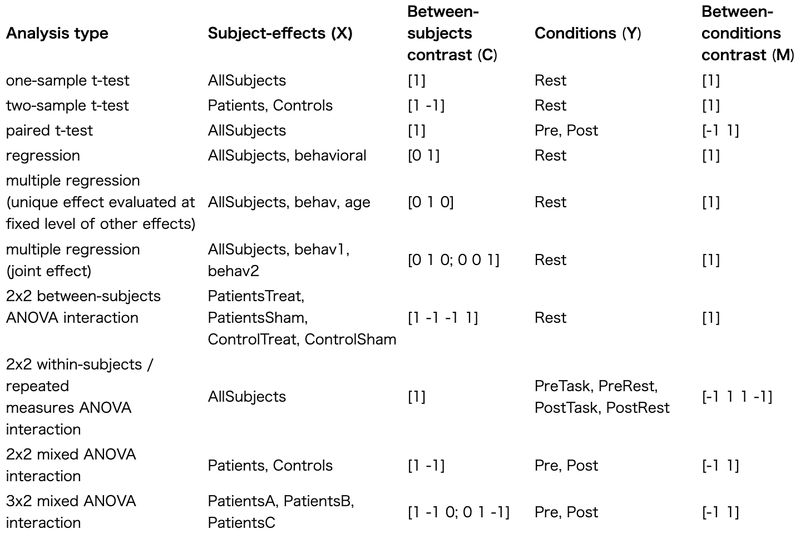

# 一般線形モデル

二次解析では、研究対象のサブセットのみの観察から一般化することで、グループや集団の特性についての推論を行うことができる。CONNは、機能的結合データのすべての第2レベルの分析に一般線形モデル（GLM）を使用します。このセクションでは、モデルの定義、パラメータ推定、仮説検定のフレームワークなど、一般線形モデルの背後にある数学について説明します。また、研究者が特定の研究課題に答えるためにこの方法を使用するのを助けることを目的とした、いくつかの実用例と一般的なガイドラインも含まれています。

## 定義と推定

$$
\mathbf{一般線形モデル}\\\\
y_n = x_n B + \varepsilon_n\\\\
$$

一般線形モデルは、説明変数/独立変数のセットXと結果/依存変数のセットYの間の多変量線形関連を定義する。機能的結合度MRI解析の文脈では、結果変数y[n]は、通常、一つまたは複数の実験条件にわたって研究中のn番目の被験者から記録した機能的結合度値をコード化する行ベクトルの形をとり、説明変数x[n]はその同じ被験者に関する一つまたは複数のグループ、行動または人口動態変数をコード化する行ベクトルになるだろう（下記の数値例セクションを参照されたい）。

Xの各説明尺度とYの各結果尺度の間の母集団における（一般に未知の）有効な関連性は， GLM式の行列Bによって特徴づけされる．ベクトル ε は，Xの知識から予測できるものを超えるすべての他の不特定要因の結果指標Yに関する累積寄与を表す（つまり，モデルの誤差項）．中心極限定理に基づき，この累積寄与を正規分布のランダム項としてモデル化することは，しばしば妥当である．GLMは，この項が被験者間で独立で，平均0，結果指標間の任意の分散-共分散構造を持つ多変量正規分布に従うと仮定する．

$$
\mathbf{通常の最小二乗法}\\\\
\hat{B} = (X^t X)^{-1} X^t Y\\\\
$$

この行列は被験者間で一定であるため、十分な被験者データを取得すれば、最小二乗法（OLS）を用いてBの妥当な不偏推定値を計算することができる。

例えば，N人の被験者データから，通常，データ行列とデザイン行列をそれぞれ，X = [x1' x2' x3' ... xN']' および Y = [y1' y2' y3' ... yN']' として構築する．そして，観測されたXとYのデータから未知行列Bの最良の線形不偏推定量を計算するために，上のOLS方程式を使用する．

## 仮説の検定

$$
\mathbf{仮説}\\\\
C B M^t = D ?
$$

行列Bの近似値を推定するだけでなく、この未知の行列Bに関する特定の仮説を、利用可能なデータから評価したいと思うことがよくあります。特にGLMでは、標準的な尤度比検定を使って、ユーザー定義の任意の対比行列C、M、Dに対して、「CBM'=D」の形の仮説を指定し、評価することができます。

同様に，行列Mの異なる形式を選択すると，対比ベクトル/行列Mの各列がデータ行列Yの同じ列と対になるので，結果測定の特定の組み合わせYに対応する仮説を構築することができる．最後に，対比行列Dの選択は，説明尺度の選択された組み合わせが，結果尺度の選択された組み合わせに及ぼす仮説の正味効果を決定する（例えば，多くの標準的な帰無仮説シナリオでは，Dはゼロに設定される）．

$$
\mathbf{尤度比検定}\\\\
\lambda = { {|W|} \over {|W+H|} }\\\\
H = ( C \hat{B} M^t - D)^t (C (X^t X)^{-1} C^t)^{-1} ( C \hat{B} M^t - D)\\\\
W = M (Y - X \hat{B})^t (Y - X \hat{B}) M^t
$$

任意のユーザー定義コントラスト行列C、M、Dについて、関連するCBM'=D仮説は、この仮説によって制約されるモデル（すなわち、CBM'が正確にDに等しいモデル）を制約されないモデル（すなわち、CBM'が任意の値をとるモデル）と比較することによって尤度比検定の文脈で定義されるウィルクスのラムダ統計量を使用して評価されます。特に、ウィルクスラムダ値は0から1の間で、制約なしモデルの残差と制約付きモデルの残差の比として計算されます。低い値（0に近い）は、検定された仮説が誤りである可能性を示し（すなわち、我々の観察から、CBM'はDと等しくないか近いと結論づけることが適切である）、一方、高い値（1に近い）は、通常、我々のデータには検定された仮説を棄却する十分な証拠がないことを示します（CBM'は正確にDかもしれないし、おそらくより可能性が高く、Dからの著しい逸脱を発見したい場合はさらにデータが必要なだけ近いのでしょう）。

$$
\mathbf{Wilks Lambda分布}\\\\
\lambda \sim \Lambda_{a,b,c}\\\\
a = rank(M)\\\\
b =  N - rank(X)\\\\
c = rank(X C^t)\\\\
$$

ラムダの特定の値（例えば0.1）が、被検仮説CBM'=Dの棄却を保証するほど低いかどうかをより正確に定義するために、観測されたラムダ値を、被検仮説が実際に真であると予想されるラムダ値の分布（ウィルクスのラムダ分布）と通常比較し、あらかじめ指定した偽陽性レベル（例えば、p<0.05の閾値を使用すると、観測ラムダ値が5％パーセント以下になったら我々の仮説を棄却するよう選択することになります）。例えば、p < 0.05の閾値を使用すると、観測されたラムダ値がウィルクスのラムダ分布の5％パーセンタイルを下回る場合、我々の仮説を棄却することを意味します）。  

Wilksのラムダ分布は、3つのパラメータを持ちます：次元の数a、誤差の自由度b、仮説の自由度c、これらは、オリジナルデータの次元とランク、コントラストマトリックスの選択から完全に決定されます。残念ながら、Wilksのラムダ分布は、限られた数のシナリオ/次元についてしか表されていないので、CONN GLMの実装では、a、b、cの特定の値に応じて、どの検証済み仮説に対しても適切な統計値とp値を導出するために、以下の変換を使用します。

### ケース1

$$
\mathbf{LRT case 1}: \Lambda_{1,b,1} (a=1, c=1)\\\\
\sqrt{\frac{1-\lambda}{\lambda}}=\frac{C \hat{B} M^t - D}{\sqrt{W C \left(X^t X\right)^{-1} C^t}} \sim \frac {1}{\sqrt{b}} T_{b}\\\\
$$

スチューデントのt分布に基づく統計、a=1、c=1（例：MとCは共にベクトル、Dはスカラー）のとき

`例`

* 2標本のt検定
* 線形回帰

### ケース2

$$
\mathbf{LRT case 1}: \Lambda_{1,b,1} (a>1, c=1)\\\\
\frac{1-\lambda}{\lambda}=\frac{(C \hat{B} M^t - D) W^{-1} (C \hat{B} M^t - D)^t}{C \left(X^t X\right)^{-1} C^t} \sim \frac{a}{b-a+1} F_{a,b-a+1}\\\\
$$

F分布に基づく統計、a>1かつc=1の場合（例：Mは行列、CとDは共にベクトル）。

`例`

* Hotellingの2標本のt二乗検定
* 反復測定ANOVA
* 多変量回帰

### ケース3

$$
\mathbf{LRT case 3}: \Lambda_{1,b,c} (a=1, c>1)\\\\
\frac{1-\lambda}{\lambda}=\frac{H}{W} \sim  \frac{c}{b} F_{c,b}\\\\
$$

F分布に基づく統計、a=1かつc>1の場合（例：Cは行列、MとDは共にベクトル）。

`例`

* ANOVA
* ANCOVA
* 重回帰オムニバス検定

### ケース4

$$
\mathbf{LRT case 4}: \Lambda_{a,b,c} (a>1, c>1)\\\\
{{1-\lambda^{1/e}} \over {\lambda^{1/e}}} \sim { {a c} \over {d}} F_{ac,d}\\\\
d=\left( b-\frac{a-c+1}{2} \right) \: e - \frac{a c}{2} + 1\\\\
e = \sqrt{\frac{a^2\ c^2-4}{a^2 + c^2-5}\ }\\\\
$$

ラオの近似F分布に基づく統計、a>1、c>1の場合（例：M、C、Dがすべて行列の場合）

`例`

* MANOVA
* MANCOVA
* 多変量回帰オムニバス検定

### 注1

「CBM'=0」という形式の両側仮説は、現実のデータではほぼ確実に誤りであると主張できる。このため、この形式の仮説が棄却されないのは、評価される効果（例えば、2群間の結合度の差）が本当に存在しないのではなく、現在の実験設定（例えば、現在の獲得パラメータと被験者数）では検出できないほど小さいことを単に示している場合が多い。この文脈では、評価される仮説の有意性だけに頼って報告するのではなく、測定された効果を常に定量化して報告する（例えば、推定B値を報告する）ことを試みることが一般的に推奨され、全く悪い考えではない。  これは、これらの効果が「存在する」（すなわち、非ゼロである）かどうかという当初の限定的な問題を超えて、ますます優れたモデルベースの推定値を構築するのに役立つ可能性があります。最後に、「CBM'>D」（LRTケース1を用いた一変量効果についてCONNで利用可能）の形の片側仮説の検定も、「実用的」有意性（効果は大きいか）と「統計的」有意性（利用できるデータから、どれだけ自信があるか）を組み合わせるツールとして使用することができる。

### 注2

$$
\mathbf{LRT alternative case 2 or 4}: \Lambda_{a,b,c} (a>b)\\\\
{tr(H) \over tr(W)} \sim { {c} \over {b}} F_{k c,k b}\\\\
d=\left( b-\frac{a-c+1}{2} \right) \: e - \frac{a c}{2} + 1\\\\
k = {tr(W)^2 \over tr(W^2)}\\\\
$$

条件数が多く、サンプルサイズが小さすぎる場合（a>b）、未知の誤差共分散Wを適切に推定できないため、Wilksのラムダに基づく統計量を使用できない場合がある。これは，例えば，ある効果が潜在的に多数の個別事例にわたって存在するかどうかを評価したいオムニバス検定の文脈では，よくあることです。このようなシナリオでは、CONNでは、保守的なSatterthwaite F分布近似に基づく統計量を使用することができます。

これらのシナリオにおけるもう1つの一般的な代替案は、モデルにとらわれない特異値分解(Strang 2007)からの最初のいくつかの特異ベクトルでスパンされる部分空間上に元のデータYを射影することによって、最初に線形次元削減ステップを適用することである。この部分空間の次元が誤差の自由度bより小さく選ばれる限り、この部分空間上の完全なGLM誤差共分散は適切に推定され、標準Wilksのラムダ統計（LRTケース2またはケース4）を使用して尤度比検定を評価することができます。

## GLMモデルと対比指定


同じ一般線形モデルの枠組みを使って、二変量、重、多変量回帰モデル、一標本、二標本、対のt検定、被験者内、被験者間の混合N-way ANOVA、MANOVAなど、非常に多くの古典的分析を指定することが可能である。特定の分析を定義するためには、GLMフレームワークのX、Y、C、M行列にそれぞれ関連する4つの項目を指定するだけでよい。

1. 被験者-効果：この分析に含めたい説明変数/独立変数のリストは何ですか？(すなわち、Xの列は何か？)
    これは通常、被験者レベルの共変量（例えば、年齢、IQ）を列挙することで定義されます。CONNでは、これらの変数は、Setup.Covariates (2nd-level) で定義されます。年齢やIQのような連続変数に加えて、ダミー・コード化されたグループ変数が、研究の被験者のグループを識別するためにしばしば有用です（例えば、Patients共変量は、患者には1、コントロールには0という値を取ります）。このような二項変数は、すべての被験者に一定の効果が必要な単純なデザインでよく使われます（CONNでは、この変数は自動的に作成され、AllSubjectsという名前で、すべての被験者に対して値1が格納されます）。
2. 被験者間対照：これらの説明・独立尺度のうち、どれを、あるいはどの組み合わせで評価・検定するか（つまり、Cベクトル・行列は何か？)
    最も単純なシナリオでは、このコントラストは単なるベクトルで、説明/独立測度と同じ数の要素を持ち、評価/検定したい個々の効果に対して1の値を持ち、他のすべての要素に対して0を持ちます（たとえば、PatientとControlの被験者をそれぞれ特徴づける2つの被験者効果を入力した場合、値 [1, 0] のコントラストベクトルは、患者における効果だけを評価/検定したいことを指定します。これは、比較したい2つの要素に1と-1を入力し、他のすべての要素（もしあれば）に0を入力するだけで定義できます（たとえば、前の例で値 [-1, 1] のコントラスト・ベクトルは、コントロールでの効果を患者での効果と比較することになります）。より複雑なコントラスト・ベクトルは，我々のモデル被験者効果の任意の線形結合の重みとして単純に指定することができる（例えば，前の例で値[0.5，0.5]のコントラスト・ベクトルは，PatientsとControl両方の被験者にわたって平均効果を推定することになる）．最後に，contrast matrices は，複数の効果を共同で評価/検定するために使用できる．ここで，個々の効果は，contrast vector として通常の方法で定義され，それらのベクトルは，単に行列に連結される（例えば，2群ではなく3群のモデルでは，contrast matrix [1, -1, 0; 0, 1, -1; 1, 0, -1] は3群間のあらゆる差の存在を評価/検定する）．
3. 条件（測定値または成果とも呼ばれる）：この分析に含めたい成果/依存尺度のリストは何か？(すなわち、Yの列は何ですか？)
    これは通常、調査したい個々の結果変数をリストアップすることで定義されます（例えば、標準的な安静時分析における単一安静条件でのSBCマップ、介入デザインにおける事前および事後条件でのSBCマップなど）。CONNでは、評価したい特定の第一レベルの機能的結合度測定と実験条件（該当する場合）の選択との組み合わせで定義される（例：安静時の1種または数種のSBCマップ）。
4. 条件間対照（between-measures or within-subjects contrastともいう）：これらの結果／依存尺度のうち、どれを、あるいはどの組み合わせで評価／試験したいのか？(つまり，Mベクトル/マトリックスは何ですか？）
    これらの対比は、上記の被験者間対比と同様に定義されるが、被験者間の影響ではなく、条件／ソース間にまたがる（例えば、介入前後のSBCマップを特徴付ける2つの条件を選択した場合、値[-1, 1]の対比ベクトルは、これらの2条件間の接続性の値を比較することになる）。
    これらの選択は一見単純に見えるが、このフレームワークを使用することで、おそらく驚くほど多くの異なる分析を指定することができる。いくつかの例を下表に示す。
    

## 数値例

$$
\mathbf{Data (Y) and Design (X) matrices}\\\\
Y = \begin{bmatrix}
0.38 & 0.74 \\\\
0.39 & 0.67 \\\\
0.47 & 0.56 \\\\
0.31 & 0.53 \\\\
0.41 & 0.62 \\\\
0.28 & 0.36 \\\\
0.29 & 0.35 \\\\
0.26 & 0.41 \\\\
0.09 & 0.53 \\\\
0.29 & 0.15
\end{bmatrix}
\quad
X = \begin{bmatrix}
1 & 0 \\\\
1 & 0 \\\\
1 & 0 \\\\
1 & 0 \\\\
1 & 0 \\\\
0 & 1 \\\\
0 & 1 \\\\
0 & 1 \\\\
0 & 1 \\\\
0 & 1
\end{bmatrix}
$$

一般的に、fcMRI解析の文脈では、何千もの個々の測定値（例えば、各ボクセルで関心のある1つの測定値を含むSBCマップ）を同時に評価またはテストすることに関心がありますが、このセクションでは、単純化と説明の目的で、単一の測定値だけを考慮し、一般線形モデルを手動で定義して、被験者間でこの測定値のいくつかの簡単な特性をテストするためにそれを使用することを進めます。

これらの例では、10人の被験者がいて、それぞれの被験者について、関心のある2つの機能的結合度（例えば、治療前と治療後に推定された2つの先験的ROI間の結合度）を計算したとします。データ行列は、右の例（Y行列）のようになり、Yの最初の列は、10人の被験者それぞれの治療前の接続性値、2番目の列は治療後の値を表します。

また、この10人の被験者が2つのグループに分けられたとします（例えば、異なるタイプの治療を受けた2つのクリニックの患者）。この情報をコード化するために，右の例のようなデザインマトリックス（Xマトリックス）を作成する．ここで，1列目はクリニック#1からの被験者，2列目はクリニック#2からの被験者を示す．

### 例1

$$
\mathbf{仮説}\\\\
\begin{bmatrix} B_{11} & B_{12} \end{bmatrix} = \begin{bmatrix} B_{21} & B_{22} \end{bmatrix}
\iff C B M^t = D\\\\
C =
\left[
   \begin{array}{cc}
      -1 & 1
   \end{array}
\right]
\quad
M =
\left[
   \begin{array}{cc}
      1 & 0 \\\\
      0 & 1
   \end{array}
\right]
\quad
D =
\left[
   \begin{array}{cc}
      0 & 0
   \end{array}
\right]
$$

今、2つのクリニックの患者間の機能的結合値の潜在的な差異を、介入前または介入後に定量化し評価したいと想像してください。これを行うには、右図のように行列C、M、Dを定義したいと思います。特に、対照Cは、2つの説明尺度の効果を比較するために[-1 1]と定義され（2つのクリニック）、対照Mは、結果尺度のいずれかに対する効果を評価するために、単位行列として定義されます（事前または事後の条件のいずれか）。この仮説を否定すると、2つのクリニックの平均連結性値が介入前後で同じになる可能性は低いと結論付けることができる。

$$
\mathbf{結果}\\\\
C \hat{B} M^t = \begin{bmatrix} -0.15 & -0.26
 \end{bmatrix}\\\\
F(2,6) = 21.50\\\\
p = 0.0010\\\\
$$

この仮説を評価するために、手動でラムダ値を計算し、自由度2、8、1のウィルクスのラムダ分布と比較することもできるし、例えば、次のような構文を使うこともできる。

[h, f, p, dof] = conn_glm( X, Y, C, M, D )

CONNは、この仮説を評価するためにcase-2変換を使用し、ここに示すF統計量と関連するp値を返します。

これらの結果は、2群の介入前後の機能的結合の軌跡が有意に異なることを示している（クリニック#1ではクリニック#2に比べて結合が高い；介入前に0.15高く、介入後に0.26高い）。この文脈でのGLM分析は、臨床（被験者間因子）の潜在的主効果を評価する混合モデル二元ANCOVAからのものと全く同じであることに注意してください。

### 例2

$$
\mathbf{仮説}\\\\
\begin{bmatrix}
    B_{11} \\\\
    B_{21}
\end{bmatrix} =
\begin{bmatrix}
    B_{12} \\\\
    B_{22}
\end{bmatrix}
\iff
C B M^t = D \\\\
C =
\begin{bmatrix}
   1 & 0 \\\\
   0 & 1
\end{bmatrix}
M =
\begin{bmatrix}
   -1 & 1
\end{bmatrix}
D =
\begin{bmatrix}
   0 \\\\
   0
\end{bmatrix}
$$

ここで、2つのグループ/クリニックのいずれかにおける2つのタイムポイント（介入前と介入後）間の機能的結合値の潜在的な差異を定量化し、評価したいとしましょう。  これを行うには、右図のように行列C、M、Dを定義することができます。特に行列Cは、2つの説明尺度のいずれか（2つのクリニック）の効果を評価するために恒等行列として定義され、行列Mは2つの異なる結果尺度（事前と事後の条件）を比較するために[1 -1]として定義されています。これは，2つのグループのどちらかで，介入前と介入後で接続性の値が異なるかどうかを評価する正味の効果がある．

$$
\mathbf{結果}\\\\
C \hat{B} M^t =
\begin{bmatrix}
   0.23 \\\\
   0.12
\end{bmatrix}
F(2,8) = 6.29 \\\\
p = 0.0229
$$

以前と同様に、手動でラムダ値を計算し、自由度1、8、2のWilksのラムダ分布と比較することにより、この仮説を評価することができます。同様に、conn_glmコールを使用すると、CONNはこの仮説を評価するためにcase-3変換を使用し、ここに示すF-統計と関連するp-値を返します。

これらの結果は、介入前と介入後で有意な機能的結合の変化があることを示している（介入後の結合は全般的に増加し、クリニック#1では0.23増加、クリニック#2では0.12増加している）。この文脈でのGLM分析は、治療（被験者内因子）の潜在的な主効果を評価する混合モデル二元ANCOVAからのものと全く同じであることに注意してください。

### 例3

$$
\mathbf{仮説}\\\\
B_{22}-B_{12} = B_{21}-B_{11} \iff
C B M^t = D \\\\
C =
\begin{bmatrix}
   -1 & 1
\end{bmatrix}
M =
\begin{bmatrix}
   -1 & 1
\end{bmatrix}
D =
\begin{bmatrix}
   0
\end{bmatrix}
$$

最後に，介入による結合度の増加（#1クリニックの0.23増加に対して#2クリニックの0.12増加）が2つのクリニックの間で有意に異なるかどうか，同様に2つのクリニック間の結合度の差（介入前の差0.15に対して介入後の差0.26）が2つの時点の間で有意に異なるかを評価しましょう．  これを行うには、右図のように行列C、M、Dを定義する必要があります。  この場合、行列Cは、2つの予測変数の寄与率を比較するために例1のように [-1 1] に設定され、行列Mは、2つの結果変数（事前と事後の条件）間の効果を比較するために例2のように [-1 1]に設定されます。これは、2つの時点の接続性のグループ間差異を比較するという正味の効果があります。

$$
\mathbf{結果}\\\\
C \hat{B} M^t = \begin{bmatrix} -0.11 \end{bmatrix}\\
t(8) = -1.10\\\\
p = 0.3041\\\\
$$

以前と同様に、手動でラムダ値を計算し、自由度1、8、1のWilksのラムダ分布と比較することによって、この仮説を評価することができますし、単にconn_glmの呼び出しを使うこともできます。CONNは、この仮説を評価するためにcase-1変換を使用し、ここに示すT-統計量と関連するp値を返します。

これらの結果は、もし治療による診療所の交互作用があったとしても、その効果は比較的小さく、この研究のサンプルサイズでは検出できないことを示しています。この文脈でのGLM分析は、クリニック（被験者間因子）と治療（被験者内因子）の潜在的な相互作用を評価する混合モデル二元ANCOVAからのものと全く同じであることに注意してください。

## 参考文献

* Mardia, K. V., Kent, J. T., & Bibby, J. M. (1979). Multivariate analysis. Probability and Mathematical Statistics, London: Academic Press, 1979.
* Rao, C. R. (1951). An asymptotic expansion of the distribution of Wilks’ criterion. Bulletin of the International Statistical Institute, 33(2), 177-180.
* Satterthwaite, F. E. (1946). An approximate distribution of estimates of variance components. Biometrics bulletin, 2(6), 110-114.

## CONN一般線形モデル分析の実行方法

CONNの第2レベル解析は、以下のいずれかのオプションを使用して実行することができます。

### オプション1: CONNのGUIを使用する


CONNでデータを分析した場合、Results ウィンドウで、次のようにして新しい第2レベルの分析を定義できます： a) Subject effects リストで、モデル中の独立測定値Xの必要なセットを選択します（たとえば、下の例ではグループ変数MALESとFEMALES） b) 選択した測定値の間で関連する被験者間対照Cを入力または選択します（たとえば、下の例では2つのグループを比較するために[1 -1] ）。[d) 条件リストで、モデルの従属測定値Yの必要な集合を選択します（たとえば、下の例ではREST条件）。この後、Results explorerをクリックすると、CONNがこれらの解析を行い、脳全体の結果を表示します（詳細は、クラスタレベルの推論を参照）。オプションで'user-defined 2nd-level model'を選択し、このモデルの名前を変更すると、将来的にCONNのGUIからこの分析に簡単にアクセスできるようになります。

### オプション2: CONNのバッチコマンドを使う

同様に、CONNでデータを解析した場合、Matlabのコマンドシンタックスを使用して、上記の例で示したのと同じ第2レベルの解析を実行することもできます。

```bash
conn_batch( 'filename',                                '/data/Cambridge/conn_Cambridge.mat', ... 

            'Results.analysis_number',                 'SBC', ...

            'Results.between_subjects.effect_names',   {'MALE','FEMALE'}, ...

            'Results.between_subjects.contrast',       [-1 1], ...

            'Results.between_conditions.effect_names', {'REST'}, ...

            'Results.between_conditions.contrast',     [1], ...

            'Results.between_sources.effect_names',    {'networks.DefaultMode.MPFC'}, ...

            'Results.between_sources.contrast',        [1], ...

            'Results.display',                         true )
```

オプションで、このコマンドに任意の代替フィールド名/値のペアを追加できます (詳細は doc conn_batch を参照してください)。

### オプション3: CONNのモジュール関数を使用する

CONNでデータを解析していなくても、他のソースからのデータに対してCONNの第2レベルGLM解析を実行したい場合（例えば、任意のソフトウェアパッケージを使用して計算された一連のniftiコントラスト画像を解析する）、以下のMatlabコマンド構文を使用して実行することが可能です。

```bash
conn module glm
```

で、新しい第2レベルのGLM分析を手動で指定します。オプションとして、このコマンドに任意のフィールド名/値のペアを追加する（追加オプションはdoc conn_moduleを参照）。例えば

```bash
conn_module( 'glm' , ...

             'data', Y, ...

             'design_matrix', X, ...

             'contrast_between', C, ...

             'contrast_within', M, ...

             'folder', outputfoldername )
```

ここで，X は GLM デザイン行列（被験者ごとに1行，モデル化された効果ごとに1列の行列），Y は入力 nifti 画像ファイル（被験者ごとに1行，指標／条件ごとに1列のファイル名のリストを含むセル行列），C は被験者間対照（X と同じ要素／列数の1ベクトル／行列），M は被験者内対照（Y と同じ要素／列数の1ベクトル／行列）である．

note: 入力 NIFTI 画像は、ボクセルベース解析では標準的な 3d ボリューム (例: .nii ファイル)、表面ベース解析では fsaverage ボリューム (例: .surf.nii ファイル)、ROI to ROI 分析では 2d マトリックス (例: .mtx.nii ファイル) が利用可能である。データから fsaverage nifti ファイルを作成する方法については conn_surf_write, conn_surf_curv2nii, または conn_surf_gii2nii のドキュメントを参照してください。データからmatrix niftiファイルを作成する方法については、conn_mtx_writeのドキュメントを参照してください。

第2水準GLMの推論と結果の解釈に関する追加情報については、クラスタレベルの推論を参照してください。

## この資料は以下のサイトを翻訳したものです

* [CONN toolbox - General Linear Model](https://web.conn-toolbox.org/fmri-methods/general-linear-model)
